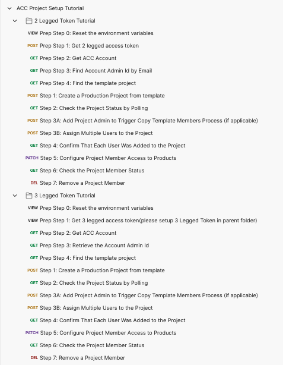

# ACC Project Setup Step-by-Step Tutorial

This folder contains a Postman Collection that contains the requests cover the current main workflow of ACC Project Setup. Including both 2 Legged token workflow and 3 Legged token workflow. Either collection shows you how to create a project from template, add a project admin, assign multiple project users, update/delete the specified project user.

## Preparation before you begin:
- [Create APS App, get an ACC Account, integrate ACC account with your APS Client Key](https://forge.autodesk.com/en/docs/bim360/v1/tutorials/getting-started/get-access-to-account/)

## Tutorials of ACC Project Setup workflow

### 2 Legged Token Tutorial
- Prep Step 0: Setup the environment variables, please specify your information as follow:
    - client_id
    - client_secret
    - account_name
    - template_project_name
    - new_project_name
    - admin_email

- Step 1: Get 2 Legged Access Token.
- Step 2: Get specified ACC Account Id.
- Step 3: Get Admin Id by email.
- Step 4: Get Project Template Id.
- Step 5: Create a new ACC project from the template.
- Step 6: Add a project admin from email, this will also trigger the coping process of template project members. 
- Step 7: Assign multiple project users.
- Step 8: Check if all the users are added successfully
- Step 9: Update the product access level for the project user.
- Step 10: Check if the project user is updated as expected.
- Step 11: Remove the user from the project.

### 3 Legged Token Tutorial
- Prep Step 0: Setup the environment variables, please specify your information as follow:
    - client_id
    - client_secret
    - account_name
    - template_project_name
    - new_project_name

- Step 1: Please get the Authorization for the parent folder `3 Legged Token Tutorial`, right click **Edit**, go to **Authorization** tab, make sure to use **OAuth 2.0** to get a 3 legged token, use it in the **Request Headers**.

    - Callback URL: https://www.getpostman.com/oauth2/callback
    - Auth URL: https://developer.api.autodesk.com/authentication/v2/authorize 
    - Access Token URL: https://developer.api.autodesk.com/authentication/v2/token

- Step 2: Get specified ACC Account Id.
- Step 3: Get Admin information of the current user, including Id and email.
- Step 4: Get Project Template Id.
- Step 5: Create a new ACC project from the template.
- Step 6: Add a project admin from email, this will also trigger the coping process of template project members. 
- Step 7: Assign multiple project users.
- Step 8: Check if all the users are added successfully
- Step 9: Update the product access level for the project user.
- Step 10: Check if the project user is updated as expected.
- Step 11: Remove the user from the project.

## License
This sample is licensed under the terms of the [MIT License](http://opensource.org/licenses/MIT). Please see the [LICENSE](LICENSE) file for full details.

## Written by
Zhong Wu [@johnonsoftware](https://twitter.com/johnonsoftware), [APS Partner Development](http://forge.autodesk.com)
